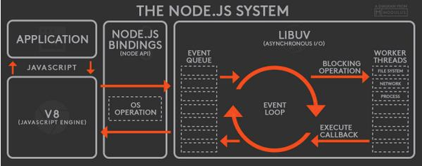

### 노드 ? 
| 노드는 자바스크립트를 이용해서 서버를 만들 수 있는 개발 도구입니다.

### 노드 탄생 비화 
| 2009년 라이언 달에 의해서 만들어진 노드..  
| 축약하면 당시 파일 업로드를 위해서 서버는 파일 업로드를 담당하는 핸들러가 동작을 완료하기까지 대기 해야 했음(동기)  
| 그래서 비동기 입출력 방식의 노드가 탄생함  
| 나머지는 알아서 잘 찾아봅니다 핥핥! (출처 : node.js 프로그래밍 30p, 31p)

--> keyword : 동기, 비동기, 블로킹, 논블로킹

### 노드의 대표적 특징

1. 비동기 입출력
2. 이벤트 기반 입출력
3. 모듈과 패키지
4. 자바스크립트 사용

### 노드 아키텍쳐

### 실습

| 이동 : ex-node.examples.ex1-hello-world.md 